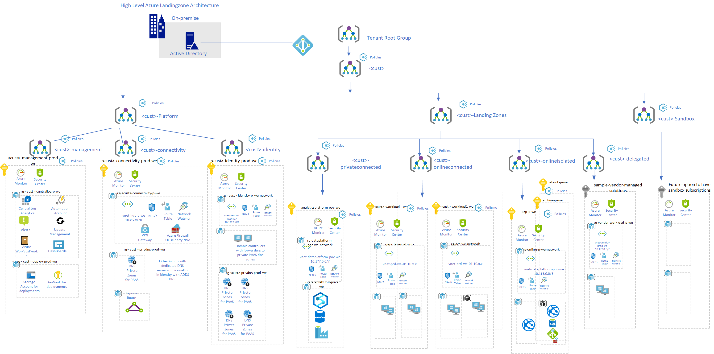

# Introduction

In this code wiki there  is an example design and scope document and cannot be considered a final.  \<\<customer name>\>  will (with the help of premier support and / or partner) be responsible for the final design and scope and its implementation. 
  
# Scope and Design
  
This is an example design of the Azure Landing Zone. The implementation partner can use this as input or have their own setup and architecture of enterprise landing zone Architecture.

Design and scope is based on Azure Cloud Adoption Framework and specifically the Enterprise Scale landing zone Architecture setup. 
See [link](https://docs.microsoft.com/en-us/azure/cloud-adoption-framework/ready/enterprise-scale/architecture).

As a reference architecture the base is taken from  "AdventureWorks Reference - Scope and Design" and partly Contoso see link
https://github.com/Azure/Enterprise-Scale.

The scope of the landing zone is the layout of the Azure base and records critical design decisions around:
- Enterprise Agreement (EA) enrollment and Azure Active Directory tenants
- Identity and access management
- Management group and subscription organization
- Network topology and connectivity
- Management and monitoring
- Business continuity and disaster recovery high on approach
- Security, governance, and compliance
- Platform automation and DevOps approach

The Azure Enterprise Landing Zone Architecture is the city plan and provides roads, water, gas, light for the application deployments in the form of:
- Central connectivity. With secure internet access, connectivity between subscription vNets and optionally to on-premise (hybrid setup).
- Central monitoring system enforced by means of Policies.
- Central identity and Azure Active Directory policy and implementation of roles and responsibilities, RBAC for support and application teams
- Policies for enforcing security and governance policies.
 
It says nothing about the specific layout / design of the specific workloads.

The basis of this document is a markdown file so that it can be brought under source control and changes can be made. 
  
## Customer profile
 
 \<\<customer name>\> uses Azure to provide innovation and implement new workload. To support innovation like WVD, Research workloads and DevTest workloads there is an enterprise scale landing zone implemented based on the adventureworks hub spoke reference implementation. The landing zone will be refactored and improved in the future when there are more requirements and multiple Regional Hubs are required and possible Virtual WAN that could be beneficial to  \<\<customer name>\>. See also refactor landing zone description of iterations see link  [link](https://docs.microsoft.com/en-us/azure/cloud-adoption-framework/ready/landing-zone/refactor). 
  
The advice is to schedule periodic improvements to make use of new features and to continuously implement improvements as the knowledge and maturity (usually in security and operating model) grows. The LandingZone consists of central connectivity based on Site to Site (S2S and in the future ExpressRoute), central monitoring and a policy implementation. All this provides the governance, network connectivity, identity, security and monitoring components and is centrally controlled by policies from a Management group structure. 

 

## First Landing deployment

Deployment in dec 2020 based on modified reference implementation of [adventureworks](https://github.com/Azure/Enterprise-Scale/tree/main/docs/reference/adventureworks), modification are done on  the naming convention. Keep in mind that the Enterprise scale reference implementation has since been updated with more policies.

 

## Landing zone overview
- A scalable management Group hierarchy for operational efficiency. Used for RBAC and Policy deployments.
- Azure Policies for enablement of controls and deployments such as Security audits, Monitoring Agents, Monitoring configurations etc.
- A dedicated subscription for management, containing services for logging, security alerting and updates.
- A dedicated subscription for the central network topology based on the Hub Spoke model with secure Express Route hybride connectivity from on premise to Azure.
- Spokes are the so-called Landing Zones which are under a management group structure of 2 level deep due to possible deviating policies. Several landing zones (Subscriptions) can fall under 1 management group
- If necessary, separate management groups are created to facilitate possible deviating policies. Workloads that do not require connectivity can also be separated into a Subscription. eg online including a possible Management group for deviating policies. 

Architecture overview management group and subscriptions.

# 8 Critical design areas

- [Enterprise Enrollment and Azure AD Tenants](./EnterpriseScaleLandingZone/1-eaTenant.md)
- [Identity and Access Management](./EnterpriseScaleLandingZone/2-iam.md)
- [Management Group and Subscription Organization](./EnterpriseScaleLandingZone/3-mngGroupSubscription.md)
- [Network Topology and Connectivity](./EnterpriseScaleLandingZone/4-network.md)
- [Management and Monitoring](./EnterpriseScaleLandingZone/5-management.md)
- [Business Continuity and Disaster Recovery](./EnterpriseScaleLandingZone/6-BCDR.md)
- [Security, Governance and Compliance](./EnterpriseScaleLandingZone/7-security.md)
- [Platform Automation and DevOps](./EnterpriseScaleLandingZone/8-devops.md)

## link to visio

-[Visio](EnterpriseScaleLandingZone/HighLevelArch.vsdx)