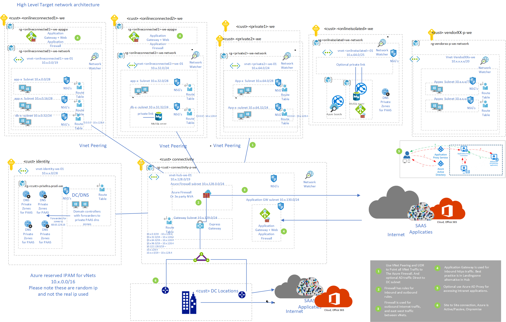
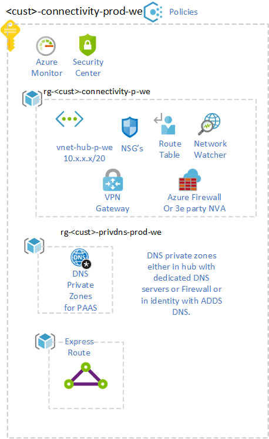

# Network Topology and Connectivity
 

## List of related features and user stories in the backlog

::: query-table e2dd3d37-ba7d-499b-8377-49ab87d39929
:::

Remove this and the above line by first go into edit mode and replace it with insert ADO query and select **Network-tags** of the imported queries.

## Introduction

 \<\<customer name>\> start with a Hybrid setup with ExpressRoute to existing datacenter locations. Based on an Hub Spoke model deployed in West Europe Region. 
This hub will host an Azure Firewall for outbound internet traffic and east west traffic filtering.
In the future, Application Gateway can also be added if a central inbound https / http is required, but it can also be placed in a landing zone per workload.

### IP Planning 
recommendations:
- Plan for non-overlapping IP address spaces across Azure regions and on-premises locations well in advance.
- Use IP addresses from the address allocation for private internets (RFC 1918).
- For environments with limited private IP addresses (RFC 1918) availability, consider using IPv6.
- Do not create unnecessarily large Virtual Networks (for example: /16) to ensure there is no unnecessary wastage of IP address space.
- Do not create Virtual Networks without planning the required address space in advance, since adding address space will cause an outage once a Virtual Network is connected via Virtual Network Peering.
- Do not use public IP addresses for Virtual Networks, especially if the public IP addresses do not belong to the customer.

### Network overview

Implementation of a zero trust model by implementing NSG, User defined routes and Azure Firewall over the existing infrastructure. 
 

The following scenarios are supported with this network design:

* Hybride setup of the existing datacenters with Azure.
* Hub - Spoke Network in the Azure Region West Europe.
* Connectivity from on-premise to Azure via ExpressRoute. 
* Landing Zone vNet's are connected through VNet peering to the Azure Virtual vNet- \<\<customer name>\>-hub-prod-we network.
* Internet outbound connectivity of all Azure vNet's is secured via Azure Firewall.
* For inbound connectivity a central Application Gateway with Application Firewall is deployed, optionally this can also go to the Landing Zones.
* As an option, DDoS can be considered as standard in vNet's which have public inbound IP.

Details van de connectiviteit subscription:

## DNS, Private DNS for PAAS

In the Hybrid setup the DNS infrastructure on premise will be extended to the cloud so a virtual machine can resolve on-premise resources and vice versa.

To make DNS resolving of PAAS services with private link available in other vNet and from on-premise the require Azure private DNS Zone will be centralized in the same subscription where the Azure DNS infrastructure will be deployed. 

These DNS servers could be Domain Controllers in Azure, Linux DNS Forwarders or InfoBlox or other 3e party. These DNS server running in Azure must then be configured to forward resolution to the Azure provided DNS at 168.63.129.16 for every used paas services like database.windows.net. The vNet hosting this DNS services must be linked to every centralized private dns zone.

Via policies the centralization of private link can be enforced see [link](https://docs.microsoft.com/en-us/azure/cloud-adoption-framework/ready/azure-best-practices/private-link-and-dns-integration-at-scale)

### Network related Policies

The following Network Policies are proposed:

<table>
<thead>
<tr class="header">
<th>Policy</th>
<th>Intent</th>
<th>Assignment scope</th>
<th>Result</th>
</tr>
</thead>
<tbody>
<tr class="odd">
<tr class="odd">
<td>Deny IP forwarding on NIC</td>
<td>Ensure IP forwarding cannot be enabled</td>
<td>Landing Zone management group</td>
<td>No IP forwarding enabled in landing zones</td>
</tr>
<tr class="even">
<td>Deny inbound RDP/SSH on NSGs</td>
<td>Ensure NSGs can't open RDP/SSH from internet</td>
<td>Landing Zone management group</td>
<td>No inbound traffic from internet on management ports</td>
</tr>
<tr class="odd">
<td>Enforce NSG on every subnet</td>
<td>Enforce default NSG is always associated to subnet</td>
<td>Landing Zone management group</td>
<td>No subnets without NSGs.</td>
</tr>
<tr class="even">
<td>Enable NSG flow logs</td>
<td>Ensure NSG flow logs are being captured</td>
<td>Landing Zone management group</td>
<td>No NSG without NSG flow logs</td>
</tr>
<tr class="odd">
<td>Enforce UDR on VNet injected services subnet</td>
<td>Enforce UDR for direct communication with VNet injected PaaS services management plane IPs</td>
<td>Landing Zone management group</td>
<td>Control plane traffic for VNet injected PaaS services works properly bypassing the default route</td>
</tr>
<tr class="odd">
<td>Ensure WAF policies are enabled on AppGW</td>
<td>Ensure all AppGWs have WAF policies enabled</td>
<td>Online management group</td>
<td>All AppGWs deployed are protected with WAF</td>
</tr>
</tbody>
</table>

---